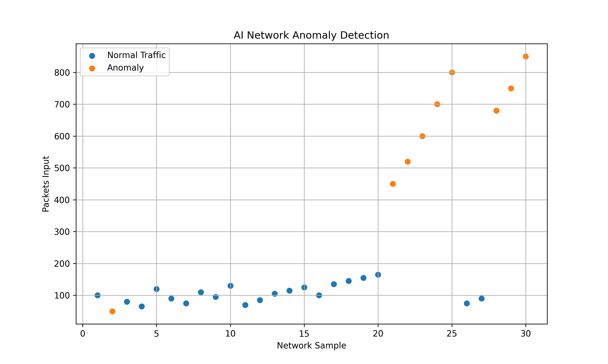
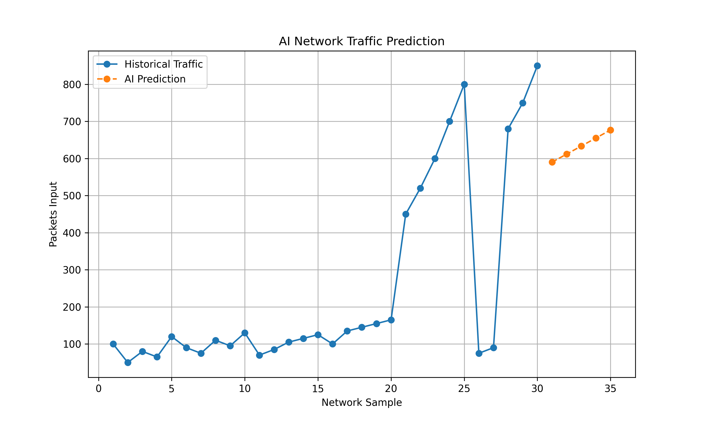

# 🤖 AI-Based Network Analytics


> **An AI-powered network analytics project that combines Cisco Packet Tracer network simulation with Machine Learning for anomaly detection and predictive network traffic analysis.**

---

## 📌 Overview

**AI-Based Network Analytics** is a student-focused cybersecurity and networking project designed to demonstrate how Artificial Intelligence and Machine Learning can be applied to network monitoring.

The project uses **Cisco Packet Tracer** to simulate a network environment and Python-based Machine Learning models to analyze network telemetry.

The system provides two major capabilities:

- 🤖 **AI-driven anomaly detection**
- 📈 **Predictive network traffic analytics**

The project also generates visual graphs to make abnormal traffic patterns and future traffic trends easier to understand.

---

## 🎯 Objectives

The main objectives of this project are:

- Simulate a computer network using Cisco Packet Tracer.
- Generate network traffic.
- Collect network-related metrics.
- Build a dataset containing network telemetry.
- Detect unusual network behavior using Machine Learning.
- Predict future network traffic.
- Visualize network anomalies and traffic trends.
- Demonstrate the practical application of AI in network analytics.

---

## 🏗️ System Architecture

```text
                    ┌──────────────────────┐
                    │  Cisco Packet Tracer │
                    │   Network Simulation │
                    └──────────┬───────────┘
                               │
                               ▼
                    ┌──────────────────────┐
                    │   Network Telemetry  │
                    │                      │
                    │ • Packets            │
                    │ • Bytes              │
                    │ • Errors             │
                    │ • Drops              │
                    └──────────┬───────────┘
                               │
                               ▼
                    ┌──────────────────────┐
                    │      Python AI       │
                    │       Engine         │
                    └──────────┬───────────┘
                               │
                ┌──────────────┴──────────────┐
                ▼                             ▼
      ┌──────────────────┐          ┌──────────────────┐
      │ Anomaly Detection│          │ Predictive       │
      │                  │          │ Analytics        │
      │ Isolation Forest │          │ Linear Regression│
      └────────┬─────────┘          └────────┬─────────┘
               │                             │
               └──────────────┬──────────────┘
                              ▼
                   ┌──────────────────────┐
                   │ AI Network Analysis  │
                   │                      │
                   │ • Normal Traffic     │
                   │ • Anomalies          │
                   │ • Future Predictions │
                   └──────────────────────┘
````

---

## 🌐 Network Topology

The initial network was created in Cisco Packet Tracer using:

* 1 × Cisco 1941 Router
* 1 × Cisco 2960 Switch
* 2 × PCs

```text
             ┌──────────┐
             │   PC0    │
             │192.168.1.10
             └────┬─────┘
                  │
                  │
            ┌─────▼─────┐
            │  Switch0  │
            │   2960    │
            └─────┬─────┘
                  │
          ┌───────▼────────┐
          │     Router0    │
          │     1941       │
          │ 192.168.1.1    │
          └────────────────┘
                  │
            ┌─────┴─────┐
            │           │
        ┌───▼───┐   ┌───▼───┐
        │  PC1  │   │ Future│
        │.1.11  │   │ Nodes │
        └───────┘   └───────┘
```

---

## 🧠 AI Components

### 1. Anomaly Detection

The project uses **Isolation Forest** for Machine Learning-based anomaly detection.

The model analyzes network features including:

```text
Packets Input
Bytes Input
Packets Output
Bytes Output
Input Errors
Output Errors
Packet Drops
```

The system classifies network observations as:

```text
NORMAL
```

or

```text
ANOMALY
```

---

### 2. Hybrid Anomaly Detection

To make the analysis more interpretable, the project combines:

```text
Isolation Forest
       +
Network Behavior Thresholds
       ↓
Final Anomaly Decision
```

Examples of abnormal indicators include:

* High packet volume
* High input errors
* Output errors
* Packet drops
* Unusual combinations of network metrics

The system also provides a reason for detected anomalies.

Example:

```text
ANOMALY

Reason:
High packet volume
High input errors
Packet drops
ML detected unusual pattern
```

---

### 3. Predictive Analytics

The project uses **Linear Regression** to estimate future packet traffic based on historical observations.

Example output:

```text
Sample 31 → 590 packets
Sample 32 → 612 packets
Sample 33 → 633 packets
Sample 34 → 655 packets
Sample 35 → 677 packets
```

This demonstrates how historical network observations can be used to estimate future traffic trends.

> ⚠️ These predictions are based on the project's simulated dataset and should not be interpreted as guaranteed real-world traffic forecasts.

---

# 📊 Visualization

## AI Network Anomaly Detection

The anomaly detection graph separates normal network observations from detected anomalies.



### Graph Interpretation

🔵 **Normal Traffic**

🟠 **Anomalous Traffic**

The graph demonstrates that abnormal observations have significantly higher packet volumes than the normal traffic range in the simulated dataset.

---

## 📈 Traffic Prediction

The project also generates a traffic prediction graph:



The graph compares:

* Historical network traffic
* AI-predicted future traffic

This provides a visual representation of the predicted traffic trend.

---

# 📁 Project Structure

```text
AI-Network-Analytics/
│
├── network_data.csv
│
├── ai_network_analytics.py
│
├── predictive_analytics.py
│
├── ai_network_dashboard.py
│
├── network_graph.py
│
├── ai_network_results.csv
│
├── anomaly_detection.png
│
├── traffic_prediction.png
│
└── README.md
```

---

# ⚙️ Technologies Used

| Technology          | Purpose                   |
| ------------------- | ------------------------- |
| Cisco Packet Tracer | Network simulation        |
| Python              | AI/ML implementation      |
| Pandas              | Dataset processing        |
| Scikit-learn        | Machine Learning          |
| Isolation Forest    | Anomaly detection         |
| Linear Regression   | Traffic prediction        |
| Matplotlib          | Data visualization        |
| CSV                 | Network telemetry storage |

---

# 🚀 Installation

## 1. Clone the repository

```bash
git clone https://github.com/yourusername/AI-Network-Analytics.git
```

```bash
cd AI-Network-Analytics
```

## 2. Install dependencies

```bash
pip install pandas scikit-learn matplotlib
```

---

# ▶️ Usage

## Run AI Anomaly Detection

```bash
python ai_network_analytics.py
```

---

## Run Predictive Analytics

```bash
python predictive_analytics.py
```

---

## Run Complete AI Dashboard

```bash
python ai_network_dashboard.py
```

---

## Generate Graphs

```bash
python network_graph.py
```

The graph generator produces:

```text
anomaly_detection.png
traffic_prediction.png
```

---

# 📊 Sample Results

The final simulated dataset contains:

```text
Total Samples    : 30
Normal Samples   : 21
Anomaly Samples  : 9
```

### Example anomaly

```text
Sample: 24

Packets Input : 700
Input Errors  : 20
Output Errors : 10
Drops         : 12

Status: ANOMALY
```

---

# 🔍 Network Metrics

The project analyzes the following metrics:

```text
┌─────────────────────┐
│ Network Metrics     │
├─────────────────────┤
│ Packets Input       │
│ Bytes Input         │
│ Packets Output      │
│ Bytes Output        │
│ Input Errors        │
│ Output Errors       │
│ Packet Drops        │
└─────────────────────┘
```

These metrics are used as features for the analytics pipeline.

---

# 🧪 Dataset

The project uses a simulated network telemetry dataset:

```csv
sample,packets_input,bytes_input,packets_output,bytes_output,input_errors,output_errors,drops
1,100,12800,100,12800,0,0,0
2,50,6400,50,6400,0,0,0
3,80,10240,80,10240,0,0,0
...
21,450,57600,440,56320,8,5,3
22,520,66560,510,65280,12,8,6
...
30,850,108800,820,104960,30,20,18
```

> The dataset is simulated for educational purposes. Initial Packet Tracer observations were used to establish the network behavior and metrics, while the complete dataset was constructed for demonstrating the ML pipeline.

---

# 🛡️ Cybersecurity Applications

AI-based network analytics can be extended to assist with:

* Network anomaly monitoring
* Suspicious traffic detection
* Network congestion analysis
* Incident detection
* Traffic forecasting
* Security Operations Center (SOC) monitoring
* Automated alert generation
* Network behavior analysis

---

# 🔮 Future Enhancements

Possible future improvements include:

* [ ] Real-time network telemetry collection
* [ ] SNMP integration
* [ ] NetFlow/IPFIX integration
* [ ] Real-time dashboard
* [ ] Live anomaly alerts
* [ ] Email notifications
* [ ] Web-based interface
* [ ] LSTM-based traffic forecasting
* [ ] Deep Learning anomaly detection
* [ ] Integration with SIEM platforms
* [ ] Automated incident response
* [ ] Real network deployment

---

# 📚 Learning Outcomes

Through this project, the following concepts were demonstrated:

### Networking

* IP addressing
* Routers
* Switches
* ICMP
* Packet transmission
* Network interfaces
* Network statistics

### Artificial Intelligence

* Machine Learning
* Unsupervised anomaly detection
* Isolation Forest
* Predictive analytics
* Linear Regression
* Feature-based analysis

### Data Analytics

* CSV datasets
* Data processing
* Network telemetry
* Data visualization
* Trend analysis

---

# 🎓 Project Type

```text
Academic / Student Project

Domain:
Artificial Intelligence
+
Networking
+
Cybersecurity
+
Machine Learning
```

---

# 👨‍💻 Author

**Syed Raihaan**

Cybersecurity Student
Interested in:

* Cybersecurity
* Network Security
* Artificial Intelligence
* Threat Detection
* Security Automation

---

# 📜 Disclaimer

This project is developed for **educational and academic purposes**.

The network environment is simulated using Cisco Packet Tracer, and the complete telemetry dataset is simulated for demonstrating the Machine Learning pipeline.

The anomaly detection results and traffic predictions should not be considered production-grade security decisions or guaranteed real-world forecasts.

---

# ⭐ Project Highlights

```text
🌐 Cisco Packet Tracer Network
        ↓
📊 Network Telemetry
        ↓
🤖 Machine Learning
        ↓
🔴 Anomaly Detection
        ↓
📈 Traffic Prediction
        ↓
📊 Visual Analytics
```

**Status: ✅ Completed**

````

### One small GitHub tip

Put these files in the **same root folder** as your README:

```text
anomaly_detection.png
traffic_prediction.png
````

Then GitHub will automatically render the graphs inside the README. Your repo will look much more polished than just dumping the Python files in there. 🔥
